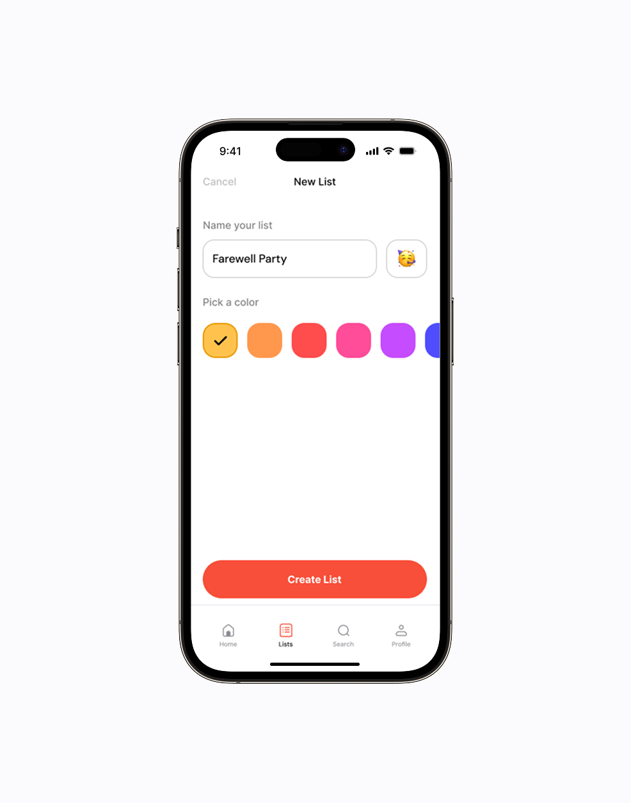
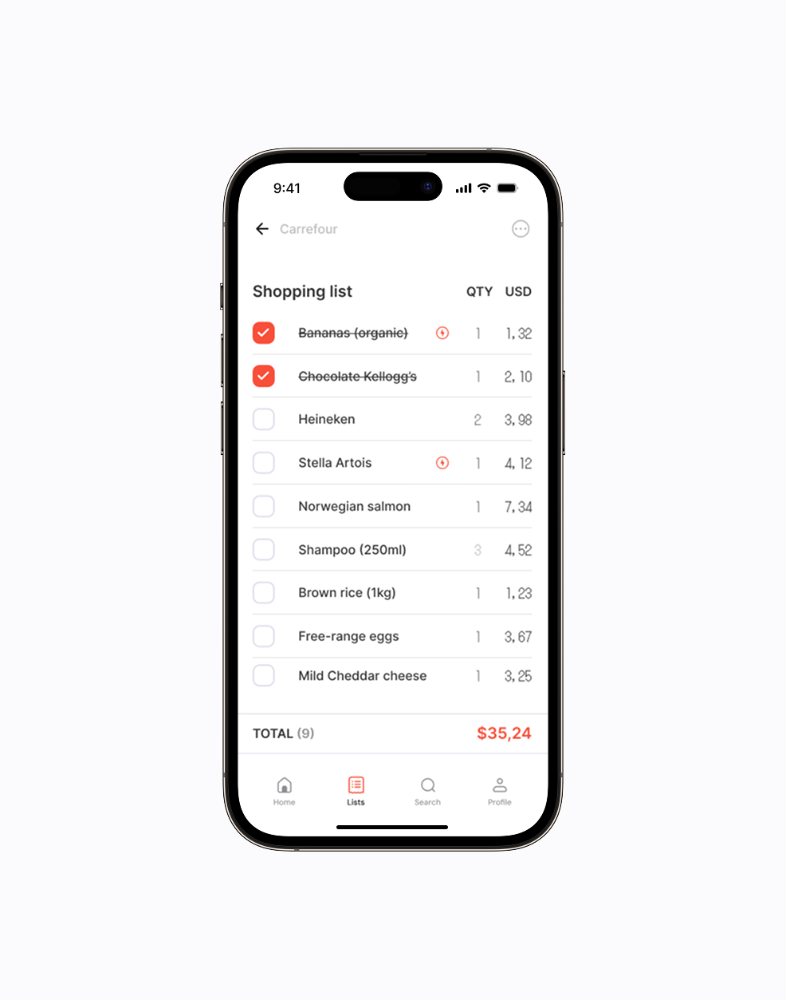

ecoco started on a road trip from Barcelona to Bordeaux. Two friends — a developer and a designer — driving through France, talking about nothing in particular, until one of us asked why grocery shopping is still such a mess.

Lists get lost. Things get forgotten. The same basket costs different money in three shops on the same street. Small problem. Universal problem. That combination is worth paying attention to.

## What the research actually said

No business plan, no investors, no deadline. So I did the only thing that costs nothing: I went and talked to people. Families doing a weekly shop, students splitting a flat, my own parents.

I went in assuming the product was a better list. **That is not what came back.**

Almost nobody described a list problem. They described two different anxieties that happened to co-occur: *forgetting something and having to go back*, and *not knowing whether they were being overcharged*. The list was the artefact, not the need.

That distinction decided the product. A list app competes with the Notes app on their phone, which is free and already open. A list app **that tells you what the same basket costs elsewhere** is doing something Notes cannot.

## The decisions that shaped it

**Reuse before creation.** The first version treated every shop as a new list. Watching people use it, the weekly shop turned out to be roughly the same shop — so we inverted it. Your last list is the starting point, and you edit the differences. That single change did more for retention than anything visual I did in six months.

**Prices are shown as comparison, not as a claim.** We do not tell you where to go. We show what it costs in each place and let you decide, because "cheapest" depends on how far you will drive and where you were going anyway. Making that judgement for people would have been faster to build and wrong more often.

**Nothing until there is something in the list.** No account wall, no onboarding tour. You can type three items before the product asks you for anything. Every gate we removed before first value moved the numbers; nothing we added ever did.

## The unromantic part

The tidy version of this story would end with the research insight. The truth is that it was messy, and the messy version is the useful one.

We were two people with jobs, studies and lives. We designed flows nobody understood. **I overcomplicated screens because they looked better that way**, and then watched somebody fail to use one in front of me, which is a specific and useful kind of quiet.

We badly underestimated how long testing takes. Not the sessions — those are quick. The part where you sit with what you heard and admit that three weekends of work is not the thing.

## Where it is now

In private beta on Android, under review by Google Play. You can build and manage lists, compare supermarket prices, and reuse a list week after week.

It is not a company. It might never be one. It has already paid for itself in what it taught me.

## What I would do differently

**Talk to people for two more weeks before designing anything.** The research finding that reframed the whole product arrived in week three. Everything I drew in weeks one and two went in the bin, and I knew at the time I was drawing too early.

**Ship the ugly version months sooner.** We polished a build nobody outside the two of us had used. Every week of that was a week of guessing, dressed up as progress.

**And take the constraint seriously as a filter.** Two people with no money cannot build the elaborate version — which sounds like a limitation and works like an editor. Most of what we cut has never come back, and I have stopped assuming that is a coincidence.
