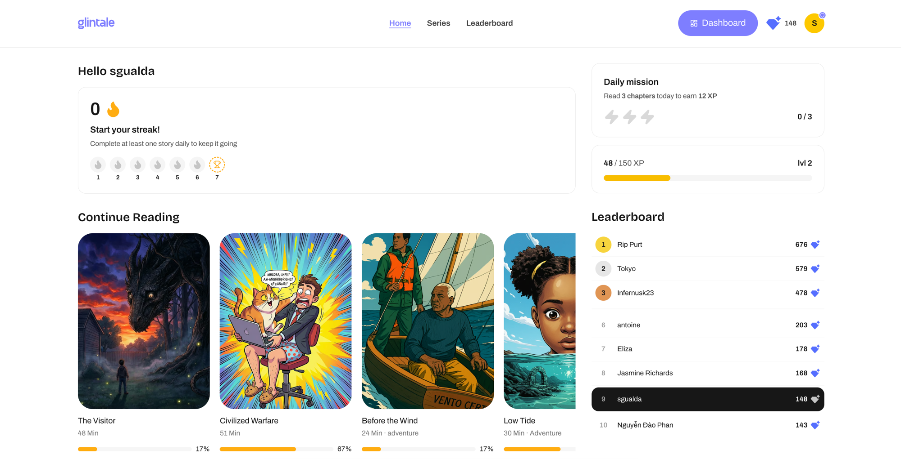

glintale is a platform for illustrated serialised fiction. Readers work through story series a chapter at a time, and the product is built around the habit rather than around the catalogue.

The idea was mine. I design it. I build it with one engineer — the same setup as [ecoco](/case-studies/ecoco-mobile-app/), which is apparently a pattern I am not learning my way out of.

## The bet

Plenty of places will sell you something to read. Almost none of them help you keep reading.

That is not a content problem, it is a **returning problem**, and it is the one worth solving. People rarely abandon a story because it got bad. They abandon it because eleven days passed, they lost the thread, and picking it up again now costs more than starting something new.

So the product is not organised around discovery. It is organised around **resumption**.

## The decisions I would defend

**Continue Reading sits above everything else, with progress on every card.** The default in this category is to open with a catalogue, because a catalogue looks like abundance. But somebody arriving at glintale has almost always already started something, and a wall of new options makes that moment harder, not easier. The percentage is there so resuming is one glance rather than an act of memory: *67% through, 51 minutes total.*

**Reading time is stated, not hidden.** Every card says 48 min, 30 min, 24 min. There is a version of this product that buries that number because it looks like a barrier. I think the opposite is true: people do not bounce off long-form because it is long, they bounce because they cannot tell **how** long, so they assume the worst and postpone. Being honest about the cost has converted better than hiding it.

**The leaderboard shows your neighbours, not just the top.** This is the one I argued hardest for. A leaderboard showing only the top three is demoralising to everyone below third — the gap is unreachable and the message is *you are not really in this*. So it shows the podium and then the band around you, with your own row highlighted. The person in ninth is not competing with the leader. They are competing with eighth, and eighth is twenty points away.

**The streak starts at zero and says so.** The empty state reads *Start your streak!* with seven grey slots and a trophy on day seven. It would be easy to hide the counter until the first day is earned. But that empty state is the invitation, and a visible zero with a visible finish line does more work than an absence.

## What I got wrong first

**I gamified before there was anything worth returning to.** The XP, the levels, the daily missions — I built those early because they were the enjoyable part and because I could see them working in my head. They moved nothing. Points on top of something nobody is gripped by are just noise with a progress bar.

What actually moved the numbers was slower and far less interesting: better chapter pacing, better covers, and cutting sign-up down to almost nothing. The gamification only started working **after** the reading was worth doing. It amplifies a habit. It cannot manufacture one.

I also spent too long on the catalogue view — the screen I most enjoyed designing, and one of the least visited in the product. That is not a coincidence, and I have started treating "this is the bit I want to work on" as a mild warning sign.

## Where it is now

Organic traffic arrives without us paying for any of it. People sign up. People come back and read. On the evidence available the thing works: there is demand, and the habit loop does what it was built to do.

That is further than most side projects get. It is also the most comfortable place to stall, which is why I am writing this bit down.

## The question I have not answered

**Will any of them pay, and how much.**

I do not know, and it is the only question that matters now. Usage is not willingness to pay — I have written [an entire check about this exact mistake](/tools/can-you-charge-for-your-product-yet/) and I am currently sitting inside it.

The signal I am waiting for is the one I tell everyone else to wait for: **somebody asking what it costs before I bring it up.** Until that happens, any price I pick is a guess wearing the clothes of a decision.

The next thing I write here will say either that it happened, or that it did not.
