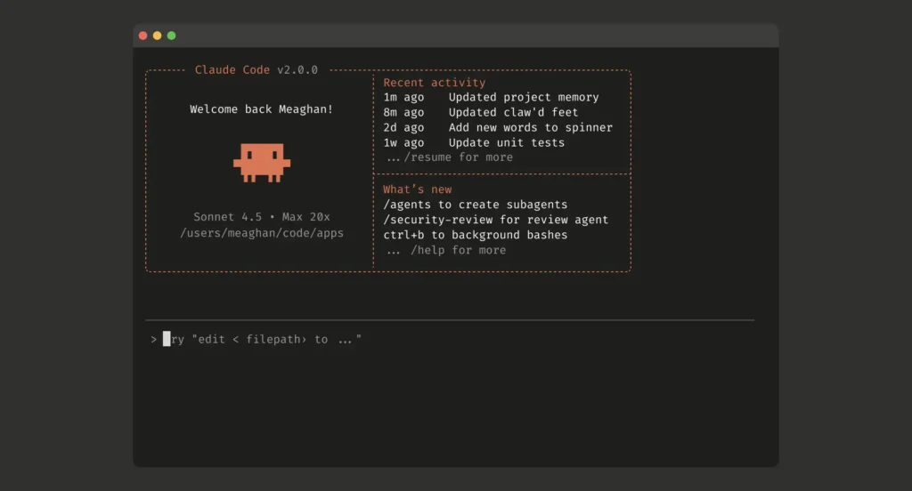

I have been using AI tools in my daily workflow for a couple of years. ChatGPT, Midjourney, Copilot, whatever came out.

Not out of FOMO. I work in product and design, and if a tool removes friction from the creative process I will try it.

Claude is the first one that changed *how* I work rather than how fast, and I have spent a while trying to decide whether that is good.

## What is actually different about it

You open it expecting another chatbot wrapping answers in bubble wrap. What you get reads more like somebody who has read the same books, understands context, and does not pad.

For product design and strategy work that matters more than it sounds. **Most of the time I do not need an AI to generate text. I need one to help me think.** Whether that comes from [Anthropic’s](https://www.anthropic.com/constitution) training approach, their constitutional AI philosophy, or better internal prompt engineering, I cannot tell you. But the difference is real, and it changed which tasks I bring to it.

## Where it genuinely earns its place

I will be specific, because vague opinion pieces about AI are the single most common thing on the internet right now.

**Research synthesis.** I paste interview notes, qualitative findings and raw observations, and ask it to find patterns. The output is not right, but it is a first pass on affinity mapping that used to take me most of a day. Is it a substitute for thinking? No. Is it a substitute for the tedious first two hours of thinking? Almost entirely.

**Product documents.** This is where I get the most out of it, and not because it writes them. It helps me structure, finds gaps in my reasoning, and plays devil’s advocate on demand. I tell it "critique this requirement" and get three angles I had not considered. A good colleague does this better, but not at 11pm, and not fifteen times in a row without getting bored of me.

**Unblocking.** Twenty minutes into a blank canvas, it is a way to start. I use less of what it produces than you would expect. Mostly it moves me from nothing to something-to-react-against, and reacting is far easier than starting.

Notice what is not on that list: **deciding what to build.** I have tried. It is confident, articulate and unaccountable, which is the most dangerous combination available.

## The part that actually worries me

Here is the uncomfortable bit.

I have noticed in myself, and in teams I work with, that the muscle for thinking without assistance atrophies. Before Claude, when I had a hard design problem, I sat with it. Let it simmer. Went for a walk, came back, tried a different angle.

Now the first reaction is to open a new conversation.

Not because the AI is bad. Because **the speed comes at the cost of a slower process where, often, the better ideas live.** Traditional design thinking has intentional friction in it. A [Google Design Sprint](https://www.thesprintbook.com/) is not badly designed, the pace it forces is a deliberate trade, and what you give up is idea maturity. Claude accelerates that further, which is useful for a startup in survival mode and dangerous for a product that needs depth.

I do not have a clean solution. What I do now is crude: for anything that looks like a [one-way door](/glossary/#one-way-door), I make myself write my own answer first, badly, before opening a conversation. It is slower, and I skip it more often than I should.

## What it means for a team, honestly

Three situations, three different answers.

**Working solo.** A straightforward multiplier. If you bill by project, the time it saves converts directly into margin and you ship more without hiring. For this situation it is probably the best software money you can spend right now.

**Early-stage startup.** It works well for fast iteration, copy, documentation, analysis, exploring options. The risk is using it to look more advanced than you are, internally and to investors. AI can make a team of four look like twelve. What it cannot replace is what team size actually buys you: friction, disagreement, and people who learned the same lesson at the same time.

**Larger company.** The most interesting case and the least exploited. Most organisations claiming to "implement AI" are using it to write newsletters. The real opportunity is scaling feedback analysis and supporting decisions with evidence, but that needs integration work and cultural change, and that is where it stalls.

## What I would want from it next

Three things, in the order they would change my week.

**Memory I can control.** Context handling on long projects is good and not enough. I want it to hold who the user is, what the strategy is, and what we decided and why, without me restating it every week.

**Reasoning I can inspect.** When it gives me a strategic recommendation I want the actual decision tree, not a generic explanation. Extended reasoning gets partway there and is still clunky.

**Integration where the work is.** Inside Figma, Notion, Linear — a contextual layer that knows what is being built, rather than a plugin that knows nothing.

## Where I have landed

The line everybody repeats is that AI will not take your job but will change it. True, and not enough.

It is not going to replace me. What it changes is **which skills are scarce.** Knowing how to do things used to be most of the job. Now the job is knowing what to ask for, recognising when the answer is confidently wrong, and being accountable for the decision either way.

That last part does not transfer. An AI can produce the argument. It cannot be the person who was wrong.

I am aware this reads as more settled than I feel. Ask me again in a year — the last two have not gone the way I expected, and the honest position is that I am running an experiment on my own working habits with no control group.
