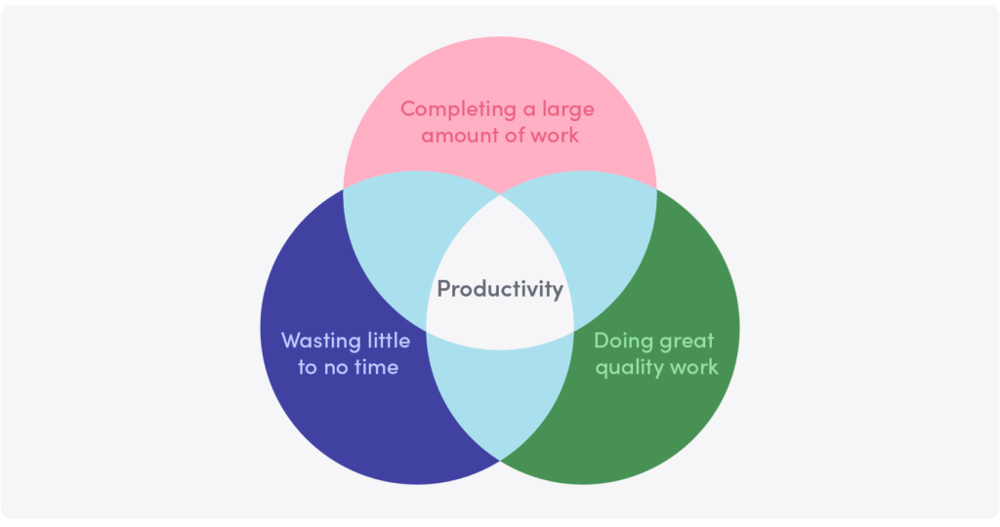
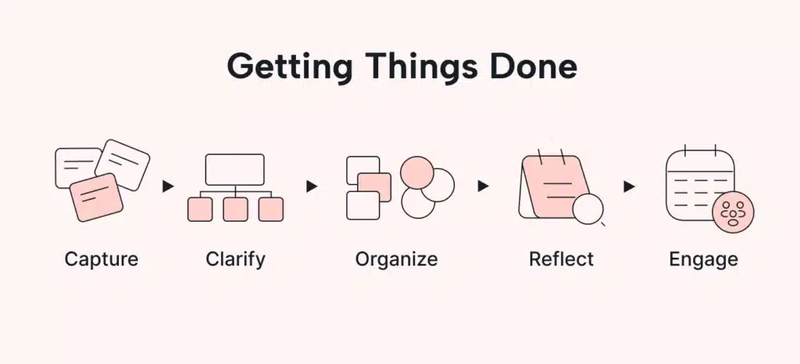

## Introduction

Have you ever felt overwhelmed by the number of tasks you need to complete? I used to feel like that almost every day. The mix of work, personal responsibilities, and small tasks piling up made me feel like I couldn’t move forward. Then, I discovered the ***Getting Things Done* (GTD) method** by [***David Allen***](https://gettingthingsdone.com/). What started as a curiosity quickly became an essential tool in both my work and personal life.

In this article, I want to share how GTD changed the way I work, organize myself, and manage my personal tasks, also **how you can benefit** from this simple yet effective system.

## What is Getting Things Done?

*Getting Things Done* is a **productivity method** that helps you reduce stress by organizing tasks and commitments into a reliable system outside of your head. By following five simple steps — **capture, clarify, organize, reflect, and engage** — GTD helps you manage your responsibilities without feeling overwhelmed.

Instead of letting tasks stay in your mind, GTD teaches you to write them down in an external system and **prioritize** them efficiently. This way, you can focus on what really matters and stop worrying about forgetting something important.

## My personal experience with GTD

Some time ago, I decided to change the way I work. I constantly felt overwhelmed by the number of tasks, which often led me to procrastinate or only complete tasks halfway. This created more stress, formed a vicious cycle, and affected both my work and personal life.

When I discovered this method, one of the first things that hit me was the famous **two-minute rule**: **if something takes less than two minutes, do it immediately**. This simple principle has had a huge impact on my routine. Before, small tasks like answering an email or making a quick decision would pile up and create a sense of chaos. Now, I do these tasks right away, preventing them from becoming a source of stress.

In addition, I started using task lists more effectively. I use [***Notion***](https://www.notion.so/) to organize my tasks by context, which helps me focus better. When I have time for work, I know exactly what tasks to tackle, and when I’m at home, I know what personal matters need my attention.

## The five steps of the GTD method

To make GTD work effectively, it’s important to understand and apply its five key steps:

### **1. Capture**

Everything starts by capturing any task, idea, or commitment that comes to mind. It doesn’t matter if it’s a small idea you had during a meeting or an important task you need to do next week. Write everything down in a trusted system, whether it’s an app or a notebook.

### **2. Clarify**

Once you’ve captured everything, you need to clarify what each item means. Ask yourself: “What is this? Is it a task I can do now or something that needs more planning?” By categorizing tasks, you can decide if it’s something you need to do yourself, delegate, or simply eliminate if it’s not important.

### **3. Organize**

Organize tasks into lists or categories based on their priority or context. For example, if you have tasks you can only do at work, put them on a specific work list. This prevents you from mixing work with personal matters and helps you focus better in each context.

### **4. Reflect**

It’s essential to review your lists and tasks regularly. I usually do a weekly review to ensure everything is up to date. This helps me know what I’ve achieved, what’s still pending, and what has become more urgent. Reflecting not only keeps me organized but also helps me focus my time and energy on what truly matters.

### **5. Engage**

The last step is simply to take action. With your system organized, you can start completing tasks without wasting time thinking about what to do next.

## What I’ve learned by applying GTD

One of the most important lessons I’ve learned from applying GTD is that **organization isn’t just about being more productive**; it’s about **reducing stress**. Having everything captured and organized in an external system frees up your mind so you can focus on what you’re doing in the moment, without worrying about other pending tasks.

GTD has also taught me to **focus on what really matters**. Now, before starting any task, I ask myself if it truly aligns with my long term goals. This simple reflection has changed the way I prioritize my time, helping me avoid wasting energy on things that, in the end, aren’t that important.

Another key takeaway is that GTD is a **process of self discovery**. It doesn’t just help you manage your tasks; it also helps you understand how you work and what you really want to achieve in both your work and personal life.

## Tips for getting started with GTD

If you feel overwhelmed by the number of things you need to do or simply want to be more efficient, here are some tips to help you get started with GTD:

1. **Start with the two-minute rule**: This small change can make a big difference in your daily life. Begin by applying this rule, and you’ll see how you eliminate small pending tasks that used to pile up.
2. **Use tools you already have**: You don’t need a fancy app to get started. Use something that works for you, whether it’s a notebook, Notion, or even your phone. The important thing is to capture everything in one place that you can easily review.
3. **Do weekly reviews**: Set aside a few minutes each week to review your tasks. This will help you keep your system updated and make sure you’re progressing toward your goals.
4. **Be flexible**: GTD isn’t a rigid system. You can adapt it to your needs and circumstances. The important thing is that it works for you.

## Conclusion

Adopting GTD has been one of the best changes I’ve made in both my personal and professional life. It has taught me to **organize myself more efficiently**, **focus on what truly matters**, and **reduce the stress I used to feel** from accumulating tasks.

If you’ve ever felt overwhelmed by the number of things you need to do, **I encourage you to try the Getting Things Done method**. It’s not just about being more productive; it’s about gaining clarity and control over your time. And the best part is that you can start today by simply capturing all those tasks floating around in your mind.

If you’re interested in learning more about my approach to productivity, design, and how I apply principles like Getting Things Done in my professional life, feel free to check out more about [**me and my journey**](/about). Here, I share how my personal and professional experiences come together to shape a genuine approach to product design and time management
