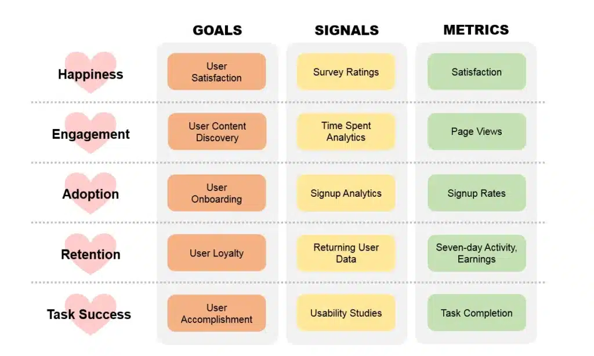

Two years ago I wrote a hopeful post about replacing [Net Promoter Score](https://www.netpromotersystem.com/) with Google's [**HEART framework**](https://www.heartframework.com/). It ended with "will it live up to the hype? Only time will tell."

Time has told. This is the rewrite.

Short version: I still use it, I use about half of it, and the part that helped had almost nothing to do with the framework itself.

## What NPS was actually costing me

NPS asks one question: *how likely are you to recommend this?* It gives you one number. That number is easy to put on a slide, which is most of why it survives.

The problem is what it cannot tell you. On one product I worked on, NPS sat between 31 and 34 for an entire quarter. Steady. Fine. Nothing to escalate.

In the same quarter, the completion rate on the main flow dropped from roughly 80% to just over 50%. People were still recommending the product, because the thing they recommended it *for* still worked. The thing that broke was the part they used every week and had learned to route around.

NPS was not wrong. It was **lagging and low-resolution** — it moves after people have already given up, and when it does move it does not say which part moved. I needed something that would have caught that in week two rather than week eleven.

## Why HEART, specifically

The HEART framework splits experience into five dimensions (**happiness, engagement, adoption, retention, task success**) and then makes you do the boring part: for each one, write down a goal, a signal, and a metric.

That last step is the whole thing. It is a table, not a philosophy, and filling it in forces a conversation nobody was having.

Ours took an afternoon and produced an argument that lasted a week, because two people on the team had genuinely different definitions of what counted as a completed task. One counted reaching the confirmation screen. The other counted the user not coming back to redo it within 48 hours.

**They were measuring different products.** We had shipped against that disagreement for a year without either of them noticing.

## The two dimensions that stuck

**Task success.** This is the one that earns its place. It is the number that would have caught the drop above, it moves fast enough to act on, and when it moves you know exactly which flow to look at. If you take one thing from HEART, take this and skip the rest.

**Engagement**, narrowly defined. Not sessions or time in app, which reward a confusing interface. We settled on *did somebody come back and do the same thing again, on their own*. That is close to what I now call [repeat use](/glossary/#repeat-use), the only usage signal I fully trust, and the reason I stopped counting sign-ups.

## The three I quietly dropped

This is the part I could not have written in 2024.

**Happiness** now runs as a twice-yearly survey and nothing more. Measured continuously it mostly tracked whether we had shipped anything recently, which I did not need a framework to know.

**Adoption and retention** were already covered by the product analytics the team had. Instrumenting them a second time under HEART labels produced two sets of numbers that disagreed by 6-8% for boring reasons, and every disagreement cost somebody an afternoon. Two numbers that nearly agree are worse than one number, because you spend the meeting reconciling instead of deciding.

So: five dimensions on paper, two in the dashboard. If that sounds like the framework failed, I would put it the other way round — it gave me a structured way to find out which three I did not need.

## HEART vs NPS: where each one is actually useful

| | NPS | HEART |
|---|---|---|
| Question it answers | Would they recommend it? | Which part of the experience is working? |
| Resolution | One number | One per dimension |
| Speed | Lags by weeks | Task success moves in days |
| Setup cost | An afternoon | An afternoon, plus about six weeks to trust the numbers |
| Fails when | The product is fine but a core flow is not | Nobody agrees what a completed task is |
| Best used for | Reporting upward | Deciding what to fix |

The honest summary: **NPS is a reporting instrument and HEART is a decision instrument.** Most teams I have met are using NPS for both, which is why it disappoints them.

## What I would tell myself in 2024

Three things.

**Start with one dimension, not five.** I set up all five because the framework has five. Three of them were dead within a year, and the setup cost was real: instrumentation, dashboards, a weekly ritual of looking at numbers nobody acted on.

**The argument is the deliverable.** The most valuable output was not a metric. It was discovering that two senior people meant different things by "done". No framework finds that for you, but this one made us sit down and write definitions, which did.

**A number nobody has ever acted on is not a metric, it is decoration.** After six months I went through the dashboard and asked, for each number, what decision it had changed. Two had. The rest came out. That question is worth more than the framework, and you can ask it today about whatever you are already measuring.

I am wary of writing this as advice, because it comes from two products and one team, and the thing I got most wrong last time was sounding confident before I had the evidence. So treat it as a report rather than a recommendation: this is what happened when I tried it, and the parts I expected to matter mostly did not.

If you want the version of this that applies to your own product rather than mine, the check on [whether feedback is real or just polite](/tools/is-user-feedback-real-or-just-polite/) covers the same ground from the other end — it is about the conversations that produce the numbers, which is where most measurement goes wrong before the dashboard is ever built.
