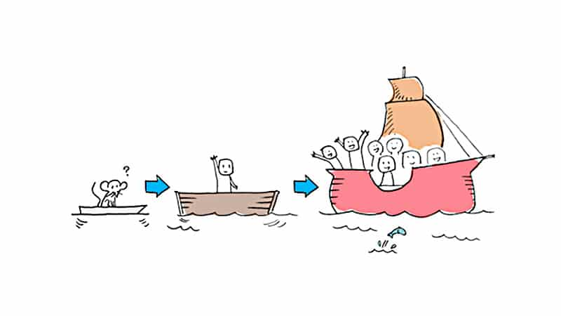

Everybody in product says **MVP**. Almost nobody means the same thing by it, and the confusion is expensive in a specific way — you end up with something too big to throw away and too rough to keep.

I know because I built that thing. It took four months.

## What I got wrong

My first understanding of an MVP was the obvious one: a **small but complete product**. Fewer features than the real thing, but real, sign-up, onboarding, settings, the lot. Something you could put in front of people without apologising.

So that is what we built. Four months, three people, most of a summer.

It launched. About sixty people signed up. Eleven came back a second time. And the thing we learned on launch day, that the problem we had picked was real but nowhere near annoying enough for anybody to change what they were already doing — **we could have learned in week two from a landing page and nine conversations.**

The four months did not buy us a better answer. They bought us the same answer, later, plus a codebase we then felt obliged to maintain because of what it had cost.

## MVP vs prototype: the actual distinction

Here is the version I wish somebody had given me.

| | Prototype | MVP |
|---|---|---|
| Purpose | Answer one question | The smallest thing worth keeping |
| Afterwards | Thrown away, on purpose | Maintained and built on |
| Can it be fake? | Yes, and usually should be | No, it has to work |
| Right size | Whatever answers the question | Whatever you would charge for |
| Failure mode | Kept when it should have been binned | Built before the question was answered |

Both are small. **The difference is what happens next**, and that is the part that decides how much it costs you.

What most teams do, and what I did, is say MVP, build a prototype, and then treat it as an MVP because of the effort already in it. That is the worst of both: too rough to keep, too expensive to bin.

## The order that actually works

Question first, then the cheapest thing that answers it.

**Is the problem real?** Nine conversations. Not "would you use this" — ask what they did the last time the problem happened. If the answer is "nothing", it is a preference rather than a problem. This is the [smallest version](/glossary/#smallest-version) of research and it costs a week.

**Will anyone move for it?** A landing page describing the thing, with one clear action. You do not need the product. You need to know whether the description alone is enough to make somebody give you an email address, which is a much lower bar than paying and a much higher one than nodding in a meeting.

**Does the thing work when they have it?** Now build. And now, and only now, does the word MVP apply, because now you are building something you intend to keep.

Each step is cheap enough that being wrong is survivable. My four months were not.

## The thing I still get wrong

I would like to end by saying I have this figured out. I do not.

The failure mode I keep falling into is not building too much any more — it is calling something a prototype so I feel allowed to build it, and then not throwing it away. The discipline is not in the naming. It is in actually binning the thing once it has answered its question, which is emotionally much harder than it sounds when you spent a weekend on it and it works.

I have got better at this mostly by writing down, before starting, the specific question the thing exists to answer. When the answer arrives the thing has no remaining purpose, and that is much easier to see on paper than in the moment.

## If you are about to build one

Two things on this site go deeper, and both come out of the same mistake:

- The check on [whether a feature is worth building](/tools/is-this-feature-worth-building/) is three questions and it is aimed exactly at the moment before you commit.
- [Stage 02 of the map — the first version](/map/first-version/) is about finding the version that can exist in the time available and still be worth showing.

And if you only take one line from this: **an MVP is not a small product, it is an experiment that happens to be made of product.** If you cannot say what it would take for the experiment to fail, you are not running one.
