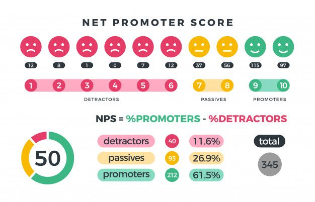

As a product designer, I’ve always felt that **Net Promoter Score (NPS)** sounds good at first. But when you think about it, it does not really tell you much. NPS has been around since 2003, thanks to Fred Reichheld and [**Bain & Company**](https://www.bain.com/). It was originally designed to measure customer loyalty for businesses. However, its roots are in **industrial design**, and it focuses primarily on customer loyalty. This makes it not the best fit for measuring **user experience** in digital products.

### Why NPS does not fully capture User Experience

NPS asks users, “How likely are you to recommend our product?” and gives us a score based on their answer. But does that really help us understand why they feel that way? Do we know what part of the experience they liked, or where things went off track? At the end of the day, it’s just a number, and honestly, that’s not enough to fully understand **user experience**.

The problem with NPS is that it does not go deep enough. A user might give a high score, but without context, we have no idea what actually made them happy. The same goes for low scores. Sure, the number tells us they were not thrilled, but without specifics, we cannot take actionable steps to improve.

### A better approach: The HEART framework

In my search for a better way to measure **user experience**, I’ve been exploring [**Google’s HEART framework**](https://www.heartframework.com/). I’m still in the process of implementing it in my projects, but it already looks much more promising. Instead of relying on one score, HEART looks at five key areas: **happiness**, **engagement**, **adoption**, **retention**, and **task success**. This approach provides a much clearer and actionable understanding of what’s working and what’s not.

Unlike NPS, HEART allows you to dig deeper into the reasons behind user behavior. For example, are users adopting your product successfully? Are they happy with their experience? Are they coming back for more? This comprehensive view helps you improve the overall user experience more effectively.

If you want to learn more about how it works, I’ve got an article on the topic that you can **[check out](https://sgualda.com/heart-framework-vs-nps-user-experience/).**

To wrap it up: **NPS** can give you a rough idea of where you stand, but if you really want to understand your users and improve their experience, it’s not enough. For me, frameworks like **HEART** offer a much better way to get the full picture and make real progress.
